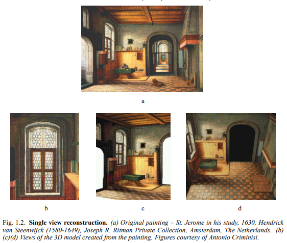

## **1.2 Camera projections**

3차원의 세계를 2차원 이미지로 표현하는 것과 그 반대가 이 책의 주요한 주제입니다. 3차원에서 2차원으로의 변환은 사영 변환의 과정입니다. 이러한 과정을 모델링 하기 위해 우리는 중앙 사영 방식을 선택합니다. 중앙 사영 공간의 한 지점에서 나오는 광선이 사영 중심인 공간의 고정된 지점을 통해 2D 이미지의 좌표에 그리는 것을 말합니다. 이 광선이 이미지 평면으로 선택된 공간의 특정 좌표와 교차하며, 이 교차점이 이미지에 그려집니다.

이 모델은 빛의 광선이 카메라 렌즈를 통과해 필름이나 디지털 장치에 그려지는, 간단한 카메라 모델(Pinhole camera)에 사용됩니다. 초점 및 렌드 두께와 같은 효과를 무시하면, 이 모델에서는 모든 광선이 렌즈 중심을 통과합니다.

사영 기하학을 이미지 처리에 적용할 때, 우리는 일반적으로 이상점을 갖는 $\mathbb{R}^3$와 동일한 3차원 사영 공간으로 모델링 합니다. 이미지의 경우는 2차원의 사영 평면 $\mathbb{P}^2$로 모델링합니다. 중앙 사영은 단순하게 $\mathbb{P}^3$에서 $\mathbb{P}^2$로 매핑하는 것입니다. 동차 좌표 $(X,Y,Z,T)^\intercal$로 나타낼 수 있는 $\mathbb{P}^3$에서 사영의 중심을 $(0,0,0,1)^\intercal$이라 할 때, $X, Y, Z$는 고정되고 $T$만 변화한다면, $(X,Y,Z,T)^\intercal$의 모든 집합은 사영의 중심점을 지나 모두 같은 좌표로 매핑이 됩니다. 결국 이미지 좌표는 동차 좌표 $(X,Y,Z)^\intercal$을 갖는 평면 $\mathbb{P}^2$의 한 좌표가 됩니다. 따라서 매핑 행렬 $P$는 $[I_{3 \times 3} | 0_3]$인 $3 \times 4$ 행렬이 됩니다. 이러한 $P$를 Camera matrix 또는 Projection matrix라고 합니다.

정리하자면 공간의 한 점에 작용하는 카메라의 매핑은 아래와 같은 동차 좌표의 선형 매핑으로 표현할 수 있습니다.
$$
\begin{pmatrix}
x \\ y \\ w
\end{pmatrix} = 
\text{P}_{3 \times 4} 
\begin{pmatrix}
\text{X} \\ \text{Y} \\ \text{Z} \\ \text{T}
\end{pmatrix}
$$

또한, 모든 점이 한 평면에 존재하는 경우 아래와 같은 수식으로 축약될 수 있습니다.

$$
\begin{pmatrix}
x \\ y \\ w
\end{pmatrix} = 
\text{P}_{3 \times 3} 
\begin{pmatrix}
\text{X} \\ \text{Y} \\ \text{T}
\end{pmatrix}
$$

**Cameras as points**

중앙 사영에서 $\mathbb{P}^3$의 점들은 위에서 설명한 camera matrix의 곱에 의해 $\mathbb{P}^2$의 점들로 매핑되며, 사영 중심을 통과하는 광선의 모든 점들은 동일한 좌표로 매핑됩니다. 이미지 사영의 목적에서는 이러한 광선에 있는 모든 점들을 동일한 것으로 간주할 수 있습니다. 또는, 더 나아가 중심을 통과하는 광선이 하나의 점을 표현한다고도 생각할 수 있습니다. 따라서 모든 이미지 점들의 집합은 카메라 중심을 통과하는 광선의 집합과 동일하다고도 볼 수 있습니다. 

위 그림 1.1에서 카메라 센터를 통해 이미지가 사영되는 것을 보여줍니다. a는 이미지 좌표가 카메라 중심을 지나 사영되는 것을, b는 그 좌표들이 어떤 한 평면 상에 사영되는 것을 보여줍니다. 또한, c는 다른 평면이더라도 같은 카메라 중심을 가지면 같은 좌표로 사영되는 것을 보여줍니다. d는 카메라 중심이 이동하게 되면, 일반적으로 그 이미지는 사영 변환과 관계가 없으나, e처럼 같은 평면에 존재한다면 사영 변환을 통해 서로를 이동할 수 있습니다.

위와 같은 원리에 의해 동일한 카메라 중심을 지나는 이미지는 사영 기하학에서 동일하다고 볼 수 있습니다. 따라서 이미지를 볼 때는 이미지에 대한 특정 좌표계를 지정해야 하며, 이는 즉 특정한 카메라 행렬을 지정하는 것과 같습니다. 간단하게 이야기하면 **시야**(**Field of View**)를 지정한다고 볼 수 있고, 이 시야를 무시하면 동일 카메라 중심에서 획득한 모든 이미지는 동일하다고 볼 수 있습니다.

**Calibrated Camera**

카메라에 찍힌 이미지와 실제 세계의 관계를 이해하려면 상대적인 유클리드 기하학을 설명할 필요가 있습니다. 여기서 말하는 상대적인 유클리드 기하학이라 함은, 2차원에서의 유클리드 기하학과 3차원의 유클리드 기하학의 상대성을 이야기 합니다.

3차원의 유클리드 기하학은 $\mathbb{P}^3$의 특정 평면을 무한면으로 지정하고 해당 평면의 특정 원뿔을 절대 원뿔로 지정해서 결정합니다. 무한면에서 원뿔형인 절대 원뿔 곡선은 이미지에 원뿔로 사영되어야 합니다. 이 결과를 **the Image of the Absolute Conic**(**IAC**)이라고 합니다. 일반적으로 이미지에서 IAC의 위치를 알면 **카메라가 보정되었다(Camera Calibration)** 라고 말합니다.

카메라가 보정되면, 이미지의 두 지점에서 back-projected 된 두 광선 사이의 각도를 결정할 수 있습니다. 앞에서 절대 원뿔 곡선과 무한면에서 만나는 위치에 의해 공간의 두 선 사이의 각도가 정해지는 것을 보았습니다. 보정된 카메라에서 무한면과 절대 원뿔은 이미지 평면에서 IAC에 일대일로 사영됩니다. 결국 IAC를 알면 광선 사이의 각도를 측정하거나 이미지 패치로 표현되는 시야를 계산할 수 있고, 이미지의 타원이 원뿔로 back-projected되는지 알 수 있습니다. 이후 챕터에서 이러한 과정을 통해 어떻게 재구성된 장면의 유클리드 구조를 결정하는데 도움이 되는지 알 수 있습니다.

**3D reconstructions from paintings**

몇 가지 가정이 필요하기는 하지만 사영 기하학 기술을 사용하면 단일 이미지에서 장면을 재구성할 수 있으며, 그림 1.2에서 그 예시를 보이고 있습니다.

### **Reference**
1. Multiple view geometry in computer vision chapter 1.2