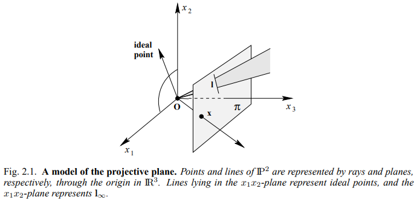

# 2. Project transformation

2D projective geometry는 projective plane $\mathbb{P}^2$ 의 *projectivies*라고 알려져있는 transformation들에서 invariant한 특성들의 연구입니다. 

Projection은  $\mathbb{P}^2$ 에서의 한점에서 $\mathbb{P}^2$ 안의 한점으로 반대로 projection 할 수 있으며, 선에서 선으로 projection 됩니다.

## projectivity
> Projectivity는 역이 성립하는 평면 $\mathbb{P}^2$ 에서 $\mathbb{P}^2$로의 mapping projection $h$를 의미합니다. 예를 들어, $\mathbf{x_1}$, $\mathbf{x_2}$ $\mathbf{x_3}$같은 선 상에 존재한다면, $h(\mathbf{x_1})$, $h(\mathbf{x_2})$, $h(\mathbf{x_3})$도 같은 선 상에 존재합니다.

이러한 projection을 collineation, projective transformation, homography 라고도 부릅니다.

## Projective transformation
> Plane의 Projective transformation은 homogeneous 3-vector에서 non-singular 3x3 행렬에 의해 표현되는 선형 변환입니다. 
$\begin{pmatrix}x\prime_1 \\ x\prime_2 \\ x\prime_3 \end{pmatrix} = \begin{bmatrix} h_{11} & h_{12} & h_{13} \\  h_{21} & h_{22} & h_{23} \\ h_{31} & h_{32} & h_{33}\end{bmatrix} \begin{pmatrix}x_1 \\ x_2 \\ x_3 \end{pmatrix}$ 
또는, 간결하게 $\mathbf{x^\prime = \mathtt{H}x}$ 로 표현할 수 있습니다.

$H$는 homogeneous matrix 이기 때문에 상수를 곱해도 동일합니다. scale factor로 나눠주면 결과적으로 동일하기 때문입니다. 따라서 H의 dof는 8이며, scale factor를 제외한 나머지 원소들입니다.

Projective transformation은 동일한 projective space 내 모든 plane을 투영적으로 동등하게 projection 시키며, 모든 이 사영 속성들은 invariant 합니다. 위 그림 2.1의 ray 모델에서 projective transformation은 $\mathbb{R}^3$의 linear transformation 입니다.

 

### 평면들의 매핑
위 그림 2.3은 동일한 projective space에 존재하는 두 평면이 존재할 때 원점 $\mathbf{O}$과 이어진 ray가 있다고 할 때, 동일 ray 위에 존재하는 점들은 같은 점이라는 것을 보여줍니다.
좌표 시스템이 평면에서 정의되고 있으면서, 그 점이 homogeneous coordinate로 표현된다면, Central projeciton은 $\mathbf{x'=Hx}$로 표현할 수 있습니다. 

### Perspective 이미지에서 사영 왜곡 지우기
Perspective 이미지에서 real world에서의 모양은 왜곡됩니다. 위 그림 2.4의 a는 그 예를 보여줍니다. 위에서 얘기했듯, projective projection의 dof는 8입니다. 따라서 4개의 점을 지정해서 projective projection을 정의할 수 있는데, 여기서는 원래는 평행한 두 직선을 지정해 다시 평행해지도록 transformation을 적용해 사영 왜곡을 삭제했습니다.

homogeneous 좌표로부터 inhomogeneous 좌표로의 변형은 위와 같이 표현할 수 있습니다. 각 포인트는 H원소에 대한 두 등식으로 표현될 수 있습니다. 

위와 같은 equation을 통해 projective transformation에 의해 점이 이동할 위치를 계산할 수 있습니다. 점을 선정할 때 주의할 점은 세 점이 같은 직선 위에 존재하면 안 된다는 것입니다.
이렇게 계산된 projective transformation $\mathbf{H}$는 non-singular matrix로 역행렬이 존재하며, 이것을 적용하면 반대로 돌아갈 수 있습니다.

그림 2.5는 $\mathbf{x'=HX}$ 수식으로 생길 수 있는 다양한 projective transformation의 예를 보여줍니다. 이 각각의 transformation은 이후 다른 Chapter들에서 학습합니다.

### Reference
1. Multiple view geometry in computer vision chapter 2.3