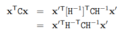

# 2.3 Project transformation
Felix Kelin에의한 기하 집합의 관점에 있어서 그의 유명한 "Erlangen Program"에서의 기하는 불변하는 특성의 연구이다. 변형 그룹안에서. 이관점으로부터 2D projective 기하는 투영평면 $\mathbb{P}^2$ 의 *projectivies*라고 알려져있는 변형 그룹하에서 불변하는 특성들의 연구이다. 

투영은  $\mathbb{P}^2$ 에서의 한점에서 $\mathbb{P}^2$ 안의 한점으로 반대로 매핑할 수 있으며, 선에서 선으로 매핑한다.

**Definition 2.9**
> *projectivity*는 반대가가능한 평면 $\mathbb{P}^2$ 에서 자기자신으로 가는 mapping $h$이다. 예를 들어, $\mathbf{x_1}$, $\mathbf{x_2}$ $\mathbf{x_3}$같은 선상에 놓여있다면 $h(\mathbf{x_1})$, $h(\mathbf{x_2})$, $h(\mathbf{x_3})$도 같은선상에 놓여있다.

투영은 그룹을 형성한다. 투영의 inverse도 투영이고 마찬가지로 두 투영의 composition역시 투영이다. 투영은 *collineation*, *투영변환*, *homograpy* 라 불린다. 이용어들은 동의어이다.

**Theorem 2.10**
> 매핑함수 $h: \mathbb{P^2} \rightarrow \mathbb{P^2} $가 *non-singular* 3x3 매트릭스 $\mathtt{H}$가 존재한다면 *proejctivity*이다. 예를들면, 어떤 벡터 $\mathbf{x}$ 에의해 표현되는 $\mathbb{P^2}$ 안의 어떤 포인트에대해서 $h(\mathbf{x}) = \mathtt{H}\mathbf{x}$는 참이다.

이 이론을 해석하기 위해서 $\mathbb{P^2}$ 안에있는 어떤 평면은 homogeneous 3-vector인 $\mathbf{x}$로 표현된다 그리고 $\mathbf{Hx}$는 homogeneous 좌표의 선형 매핑이다. 이 이론은 어떤 투영이든 호모지니어스 좌표에서 선형변환처럼 일어난다는것을 주장한다. 그 이론은 여기서는 완전히 증명되진 않는다. 어떤 homogeneous 좌표의invertible한 선형 변형은 투영이다.

**Definition 2.11. 투영변환**
> 평면 투영 변형은 선형 변환이다. homogeneous 3-vector에서 non-singular 3x3 행렬에의해 표현되는 : $$\begin{pmatrix}x\prime_1 \\ x\prime_2 \\ x\prime_3 \end{pmatrix} = \begin{bmatrix} h_{11} & h_{12} & h_{13} \\  h_{21} & h_{22} & h_{23} \\ h_{31} & h_{32} & h_{33}\end{bmatrix} \begin{pmatrix}x_1 \\ x_2 \\ x_3 \end{pmatrix}$$ 또한 간결하게 $\mathbf{x^\prime = \mathtt{H}x}$ 로 표현한다.

이 방정식에서 발생하는 행렬 $H$는는 곱하기에의해 변할지모른다. 0이아닌 임의의 scale factor에의해서 투영변환을 바꾸지않고. 결과적으로, H는 *homogeneous* 행렬이다. 한지점의 homogeneous표현으로서 표현으로서 오직 행렬 요소의 비율만 중요하기때문이다. 9개의 H 요소중에서 8개의 독립적인 비율들이있다. 따라서 투영변환이 8개의 자유도를 갖는다.

투영변환은 모든 그림을 투영적으로 동등한 그림으로 투영시키며, 모든 이 투영특성들은 불변이다. 그림 2.1의 ray 모델에서 투영변환은 간단하게 $\mathbb{R}^3$의 선형변환이다.

**평면들 사이에서의 매핑** theorem 2.10 에서 적용되었던 예처럼, 그림 2.3을 생각해봐라. commont point를 통과하는 ray를 따르는 투영은  하나의 평면에서 다른하나의 평면으로 매핑되는것을 정의합니다. 이 점대점 매핑은 한평면에서 어떤 선이 다른 선으로 매핑되는 선을 보존합니다. 만약 좌표시스템이 각 평면에서 정의되고 점이 동치좌표계로 표현된다면, 중앙투영매핑은 $\mathbf{x^\prime} = \mathtt{H}\mathbf{x}$에 의해 표현됩니다. 그리고 H는 non singular 3x3 matrix입니다. 실제로, 만약 두 평면에서 정의된 두좌표계둘다 유클리디안 좌표시스템이라면 중앙투영에의해 정의된 매핑은 임의의 투영변형보다 더 많이 제한적입니다. 이것은 완전 투영이라기보다는 *perspectivity*라 불립니다. 그리고 6개의 자유도로 표현됩니다. 우리는 section A7.4에서 다룹니다.

**예제 2.12 perspective 이미지 에서 투영왜곡 지우기**
prespective 이미지에서 모양은 왜곡되어있습니다. 예를들어 그림 2.4a에서 창문은 사각형이아닙니다. 평면에서 일반적인 평행선들은 평행하지 않습니다. 대신에  유한한점으로 한점에 모입니다. 우리는 이미지평면의 중앙 투영이 원조 평면과 연관되어있다고봅니다. 투영 투영을 통해서, 또한 이미지는 원본의 투영왜곡이 있습니다. 이 투영편형은 "취소" 할 가능성이 있습니다. inverse  변형으로 계산해서 그리고 그것을 이미지에 적용시킬수있습니다. 결과는 새로운 합성된 이미지일것이며 이것은 평면에서 객체들은 그들의 보정된 기하학 모양으로 보여집니다. 이것은 여기서 표현됩니다. 그림 2.4 a의 빌당 앞부분에서 표현됩니다. 땅과 앞이 같은 평면에 있지 않기때문에, 바로잡기위해 적용되어져야하는 투영변환은 은 땅에서 사용된것과는 동일하지 않습니다. 
지금은 변형을 계산하는 방법에대해서 간단하게 설명할것입니다. 월드평면부분과 일치하는 section을 선택함으로써 시작합니다. 로컬 2D평면과 월드좌표계는 선택됩니다. 그림2.3에서 보이듯이. 매칭 포인트 x와x 프리임 비동치좌표계를 사용합니다. 왜냐하면 이미지로부터와 월드좌표계로부터 곧바로 측정되는것이 바로 비동치좌표계이기떄문입니다.

비동치 좌표계는 아래와같이 표현되어질 수 있습니다. 각 포인트는 H원소에대한 두 등식으로 표현될 수 있습니다. 

이 등식은 선형입니다. 4개의 점은 여덟개의 선형 등식으로 이끕니다. 그리고 이것은 중요한 multiplicative factor로 풀기에 충분합니다. 유일한 제한은 4개의 점은 "일반적인 위치"에 있어야합니다. 그리고 이것은 세점은 같은 선상에있으면 안됩니다. 이방법으로 계산되는 변형 행렬 H의 역행렬은 전체이미지에 적용됩니다. Perspective 왜곡의 영향을 취소하기위해서 그결과는 2.4b에 표현됩니다. 

이예에서 고려하는 세가지는 다음과같습니다. 첫째, 바로잡는 변환행렬 H의 계산은 어떤 카메라 파라미터나 평면의 위차기 필요하지 않습니다, 두번째로, 이는 항상 필요하지 않습니다. 투영 왜곡을위해서 네가지 포인트를 위한 좌표를 알필요는 없습니다: 대안적인 접근이며, 이는 2.7에서 묘사되니다. 그리고 정보의 다른 타입입니다. 세번째, 더나은 방법들은 계산 투영변환은 chapter 4에서 묘사됩니다.

투영변환은 매핑표현이 더중요합니다. 월드평면의 Perspective 이미지보다는, 많은예들은 그림 2.5에서 표현됩니다. 이 상황들의 각가은 이책의 나머지부분에 표현됩니다.

# 2.3.1 Transformations of line and conic

**Transformation of lines**
theorem 2.10의 증명에서 보다싶이, 만약 point xi는 line l에 높여있습니다. 그리고나서 그 투영변환 하에 있는 변형된 포인트 $\mathbf{x}^\prime=\mathtt{H}\mathbf{x}_i$는 $\mathbf{l}^\prime = \mathtt{H}^\mathsf{-T}\mathbf{l}$ 에 놓여있습니다. 이 방법으로 선에서 포인트의 incidences는 보존됩니다. 점 변환 Hx 하에 놓여있기때문에, 선 변환은 $\mathbf{l}^\prime = \mathtt{H}^\mathtt{-T}\mathbf{l}$로 표현됩니다.
대안적인 표현으로는 $\mathbf{l}^{\prime \mathsf{T}} = \mathbf{l}^{\mathsf{T}}\mathtt{H}^{-1}$ 가 있습니다. 기본적인 선과 점의 다른 방법이있다는것을 확인바랍니다. 점은 변형한다 H에따라서, 반면에 선들은 변형한다 $\mathtt{H}^{-1}$ 에따라서 변형됩니다. 이것은 "covariant" 혹은 "cotravariant" 의 용어로 표현됩니다. 포인트들은 변형합니다 *Contravarinatly*로, 선들은 *covaraintly*로 변형합니다.

**Trasformaiton of conics** 점변환 $\mathbf{x}^\prime = \mathtt{H}\mathbf{x}$ 하에서 (2.2)는 하기 수식처럼됩니다. 4차방정식 형태 $\mathbf{x^\prime}^\mathsf{T}\mathbf{Cx^\prime}$, $\mathbf{C}^\prime = \mathtt{H}^{-\mathsf{T}}\mathbf{C}\mathtt{H}^{-1}$ 로 표현됩니다. 이것은 conic에대한 규칙입니다.

**Result 2.13.** 
> *점 변환* $\mathbf{x^\prime} = \mathtt{H}\mathbf{x}$ *하에서, 어떤 conic C 는*  $\mathbf{C}^\prime = \mathtt{H}^{-\mathsf{T}}\mathbf{C}\mathtt{H}^{-1}$로 변환됩니다. 

이 등식에서 $H^{-1}$의 존재는 conic 은 *covariantly*하게 변환된다고 말할 수 있습니다. dual conic의 변환규칙은 유사한 방법으로 유도됩니다.

**Result 2.14.**
> *점변환* $\mathbf{x\prime} = \mathtt{H}\mathbf{x}$ *아래에서, dual conic* $\mathsf{C^\ast}$ 은 $\mathsf{C^{\ast\prime}} = \mathtt{HC^\ast H^T}$로 변환욉니다.
