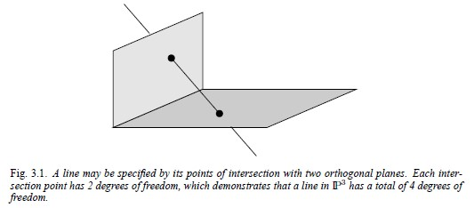

# Chapter 3.2 Representing and transforming planes, lines and quadrics

### 3.2.1 Planes

3차원의 평면은 다음 식으로 나타낼 수 있습니다.
$$\pi_1X + \pi_2Y + \pi_3Z + \pi_4 = 0$$
homogeneous 좌표계에서는 스케일 값은 고려하지 않으므로, 각 미지수에 곱해진 값의 비율이 중요합니다. 따라서 평면은 dof 3(degree of freedom, 자유도)을 가집니다.

즉, 평면의 homogeneous representation로 나타내보면 다음과 같습니다.
$$\pi = (\pi_1, \pi_2, \pi_3, \pi_4)^T$$
점 X가 평면 $\pi$ 위에 있을 때, 간결하게 나타내면 다음과 같습니다.
$$\pi^TX = 0$$

#### Join and incidence relations

3차원 사영 공간에서는 면, 점, 선의 다양한 기하학적 관계가 있습니다.

1. 동일 직선 상에 있지 않은 점 3개 또는 동일 직선 상에 있지 않은 점 1개와 선 1개로 유일한 평면을 결정할 수 있습니다.
2. 서로 다른 2개의 평면은 한 직선에서 교차합니다.
3. 서로 다른 3개의 평면은 한 점에서 교차합니다.

#### Three points define a plane

점 3개가 평면 $\pi$ 위에 있다고 가정하면, $\pi^TX_i = 0$ (i=1,2,3) 이므로, 행렬로 나타내보면 다음과 같다.

$$\begin{bmatrix}X_1^T \\ X_2^T \\ X_3^T \end{bmatrix} \pi = 0$$

단, 3개의 점은 선형 독립이어야(동일 직선 상에 있지 않은 점 3개) 고유한 평면 방정식을 구할 수 있다. 이 경우에는  rank는 3입니다. 따라서 평면 $\pi$는 1차원 null space 로 고유하게 구할 수 있습니다. 만약 좌변의 왼쪽 행렬 rank가 2이고 null space가 2차원이면 점은 동일선상에 존재하며 그 선을 축으로 하는 pencil of plane을 정의할 수 있습니다.

null space를 사용하지 않고 좀 더 간단하게 평면을 구할 수 있는 방법도 있습니다. 평면 $\pi$ 를 정의하는 세 점 $X_i$ 와 일반 점이 X로 구성된 행렬 $M = [X, X_1, X_2, X_3]$가 있다고 할 때, 점 X가 평면 $\pi$ 위에 있으면 행렬식 $det M = 0$이 됩니다.

열 X에 대해서 행렬식을 전개하면 다음과 같습니다.

$$det M = x_1D_{234}-x_2D_{134}+x_3D_{124}-x_4D_{123}$$

$D_{jkl}$은 4x3 행렬 $[X_1, X_2, X_3]$의 jkl 행으로 구성된 행렬식

$\pi$의 점에 대해 det M = 0이므로, 평면 계수는 다음과 같습니다.

$$\pi = (D_{234}-D_{134}+D_{124}-D_{123})^T$$

이 식은 다음 식의 null space 해가 됩니다.

$$\begin{bmatrix}X_1^T \\ X_2^T \\ X_3^T \end{bmatrix} \pi = 0$$

#### Three planes define a point

세 개의 평면 $\pi_i$ (i=1,2,3) 이 있을 때, 세 평면의 교점 X는 다음 행렬식을 만족한다.

$$\begin{bmatrix}\pi_1^T \\ \pi_2^T \\ \pi_3^T \end{bmatrix} X = 0$$

#### 평면의 사영 변환

점 변환 식에서 평면 변환 식으로 바꾼 식은 다음과 같습니다.
$$\pi^{\prime} = H^{-T}\pi$$

#### Parametrized points on a plane

평면 $\pi$상의 점을 다음으로 표현할 수 있습니다.
$$X = Mx$$
4x3 행렬 M의 열은 $\pi^T$의 rank 3인 null space를 생성합니다. 수식으로 나타내보면 다음과 같습니다.
$$\pi^TM = 0$$
M은 유일하지 않습니다. 평면이 $\pi=(a, b, c, d)^T$일 때, a가 0이 아니라면 $M^T = [p|I_{3x3}]$ 으로 나타낼 수 있습니다. 여기서 $p=(-b/a, -c/a, -d/a)^T$ 입니다.

## 3.2.2 Lines

선은 두 점의 연결 또는 두 면의 교차로 정의할 수 있습니다. 3차원 공간에서 dof는 4입니다. 3.1그림에서와 같이 직교하는 평면 2개의 교점으로 정의한 직선을 생각해보면 dof를 계산하기 쉽습니다.

[Fig 3.1] 직교 평면과의 교점으로 선을 지정할 수 있습니다. 각각의 교점은 dof 2를 가져서 3차원 사영 공간의 직선의 총 dof는 4입니다.

