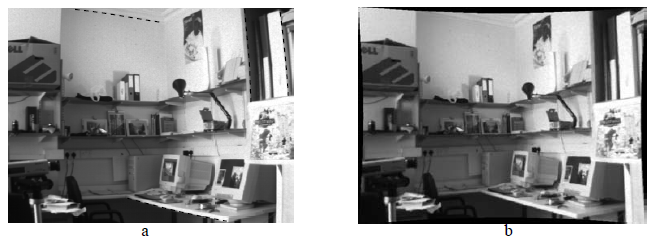
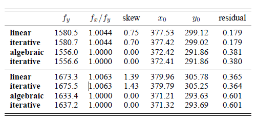

# 7.4 Radial distortion

이전 챕터에서는 linear model이 이미지 프로세싱에 정확한 model이라는 가정에 기반했습니다. 그래서 the world point, image point와 optical center는 동일 선상에 존재합니다. 그러나 실제 렌즈는 이러한 가정이 맞지 않습니다. 이 변형은 일반적으로 카메라 왜곡의 가장 중요한 점입니다. 카메라 왜곡(radial distortion)을 보정하는 과정을 거쳐 linear image로 만들게 됩니다.

방사 왜곡은 이미지 평면에 세계를 처음 투영하는 동안 발생합니다. 그 후, calibration matrix (7.6)은 이미지의 아핀 좌표 선택을 반영하여 이미지 평면의 물리적 위치를 픽셀 좌표로 변환합니다.

### Correction of distortion (왜곡 보정)

pixel coordinates에서 보정은 다음과 같은 식으로 나타낼 수 있습니다.
$$
\hat{x} = x_c + L(r)(x-x_c)
$$

$$
\hat{y} = y_c + L(r)(y-y_c)
$$

(x, y) 는 측정된 점의 좌표

$(\hat{x}, \hat{y})$ 는 보정된 점의 좌표

$(x_c, y_c)$ 는 방사 왜곡의 중심 좌표

이 보정을 통해 $(\hat{x}, \hat{y})$ 는 선형 projective 카메라에 의한 3D world 점으로 옮겨집니다.

### Choice of the distortion function and center

함수 L(r)은 r의 양수 값과 L(0) = 1인 경우에 대해서만 정의됩니다. 함수 L(r)에 대한 근사값은 테일러 전개에 의해 주어질 수 있습니다. 방사형 보정에 대한 계수 {κ1, κ2, κ3,..., xc, yc}는 interior calibration of the camera로 결정됩니다. The principal point은 방사 왜곡의 중심으로 자주 사용됩니다. (정확히 일치할 필요는 없습니다.) 이 보정을 통해 카메라 교정 행렬은 이미지 지점에서 광선으로의 매핑을 지정합니다.

### Computing the distortion function

함수 L(r)은 선형 매핑으로부터의 편차에 따른 비용을 최소화하여 계산될 수 있습니다. 예를 들어, 알고리즘 7.1(p181)은 figure 7.1에서의 Tsai 격자 같은 교정 대상에 대한 기하학적 이미지 오류를 최소화하여 P를 추정합니다. 왜곡 기능은 다음의 일부로 포함될 수 있습니다. 이미지 프로세스 및 반복 중에 P와 함께 계산된 매개변수 κi 기하학적 오류를 최소화합니다. 마찬가지로, 단일 Tsai 격자와 그 이미지 사이의 homography를 추정할 때 왜곡 함수가 계산될 수 있습니다.

L(r)을 계산하는 간단하고 일반적인 접근 방식은 직선 장면의 이미지는 직선이어야 한다는 것입니다. 비용 함수는 L(r)을 올바르게 연결지은 후의 이미지 선으로 정의됩니다. 이 비용 함수는 순차적으로 방사 왜곡의 중심과 왜곡 함수의 파라미터 $K_i$에 의해 최소화됩니다. 

#### Example 7.3 Radial correction

****

640X480 크기의 이미지

minimizing a cost based on the straightness of imaged scene lines

#### Example 7.4

****

방사 왜곡은 straight line 방법에 의해 제거됩니다.

방사 왜곡을 교정할 때 실제로 이미지를 왜곡할 필요가 없는 경우가 많습니다. 예를 들어 모서리 특징의 위치는 같은 원본 이미지에서 측정할 수 있으며 측정은 (7.7)에 따라 간단히 매핑됩니다. 기능을 어디에서 측정해야만 하는지에 대한 질문에는 명확한 답이 없습니다. 이미지를 왜곡하면 (평균화로 인해) 노이즈 모델이 왜곡되고 aliasing effects가 발생할 수도 있습니다. 이러한 이유로 왜곡되지 않은 이미지에서 특징을 감지하는 것이 더 나은 경우가 많습니다. 그러나 edgel(사물의 가장자리로 인식되는 이미지의 픽셀)을 line primitive(더 복잡한 그래픽 이미지를 만들기 위해 결합될 수 있는 선, 곡선, 다각형과 같은 기본 요소)로 연결하는 것과 같은 특징 그룹화는 원본 이미지에서 선형성에 대한 임계값이 잘못 초과될 수 있으므로 warping후에 가장 잘 수행됩니다.

