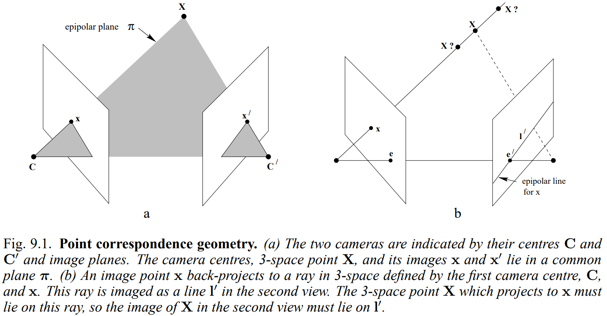
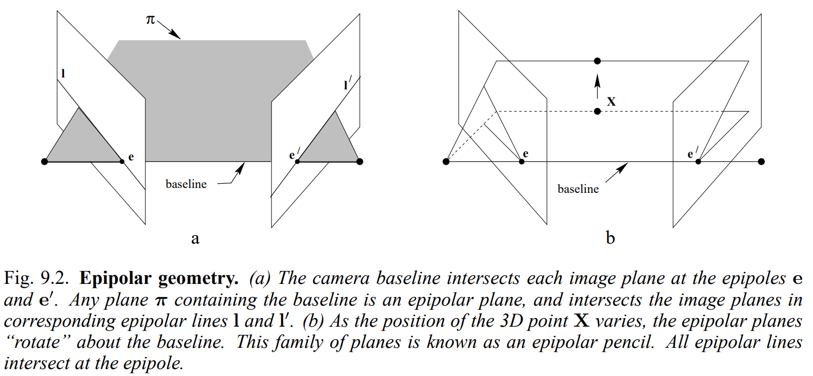

# Chapter 9. Epipolar Geometry and the Fundamental Matrix

# 1. Epipolar Geometry

Epipolar geometry는 두 시점 사이의 사영 기하학으로, camera center를 연결하는 선인 기준선(baseline)을 축으로 하는 평면의 집합과 이미지 평면의 교차점에 대한 기하학입니다.

이러한 기하학은 각 scene들의 구조와는 무관하며 카메라의 intrinsic parameter와 pose만으로 정의됩니다.

위 그림 9.1과 9.2에서 epipolar geometry 보이고 있습니다.

3차원 점 $X$가 왼쪽과 오른쪽 시점 각각에서 $x, x'$로 투영된다고 가정해봅니다. 이 때 두 점들의 관계는 9.1a에서 볼 수 있듯, 이미지 점 $x$와 $x'$, 3차원 점 $X$ 그리고 카메라 중심이 모두 같은 평면에 놓인다는 것입니다. 이 때 이 평면을 epipolar plane이라 합니다. 또한, 다른 view에서의 ray를 다른 view에 투영했을 때 생기는 선을 epipolar line이라고 합니다. stereo matching 알고리즘의 방면에서 볼 때, epipolar line을 알게 되면 대응하는 점을 그 안에서만 찾으면 되는 장점이 있습니다.

그림 9.2는 epipolar geometry에 대한 객체들을 그림으로 표현했습니다.

- Epipole은 이미지 평면과 카메라 중심을 연결하는 선의 교점
- Epipolar line은 epipolar plane과 이미지의 교선
- Epipolar plane은 baseline을 포함하는 평면이며, 3차원 점 $X$의 위치가 변함에 따라 baseline을 기준으로 회전 가능. 또한, epipolar line의 대응을 결정.

### **Reference**
1. Multiple view geometry in computer vision chapter 9.1