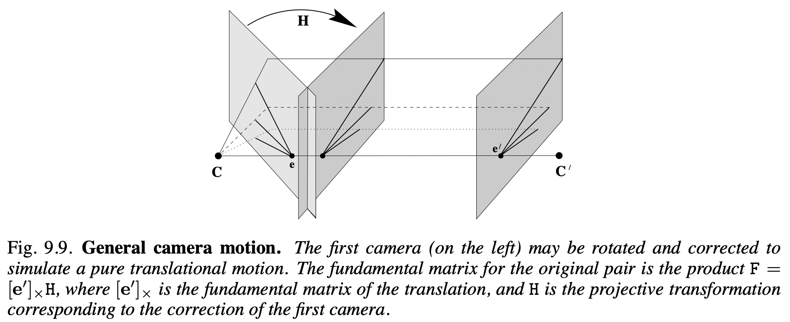

# 3. View transformation following Camera motion

점 x를 $x=(x,y,1)^\intercal$로 정규화하면, $x=PX =K[I|0]X$에서 $X$를 inhomogeneous 형태로 나타내면 $(X,Y,Z)^\intercal = ZK^{-1}x$가 됩니다. 여기서 $Z$는 depth이며, $K$는 intrinsic parameter 입니다.

이 때 먼저, 카메라의 회전없이 평행 운동만 하는 경우를 가정해보겠습니다.

그러면 $x' = P'X = K[I|t]X$가 되고, 이 변환은 $x' = x + Kt/Z$로 변환될 수 있습니다.

위 그림 9.9는 일반적인 camera 모션을 보이고 있습니다. 위 변환에서 회전이 추가된 경우인데, 이 경우에는 $P' = K'[R|t]$가 됩니다. 이 때, 필요한 사영 변환 H는 $K'RK^{-1}$입니다. 그러면 위 수식에서 $x$에 사영변환 $H$로 회전을 추가하면 되니까 수식은 $x' = K'RK^{-1}x + Kt/Z$가 됩니다.

이 때, 이 수식에서 중요한 전제 조건은 $P$가 $[I|0]$ 라는 것입니다. 여러 데이터셋이나 실제로 SfM을 통해서 얻을 수 있는 Projection matrix는 대부분 저런 형태가 아니기 때문에 이러한 사항을 적용해줄 수 있어야 합니다.

### **Reference**
1. General motion of Multiple view geometry in computer vision chapter 9.3